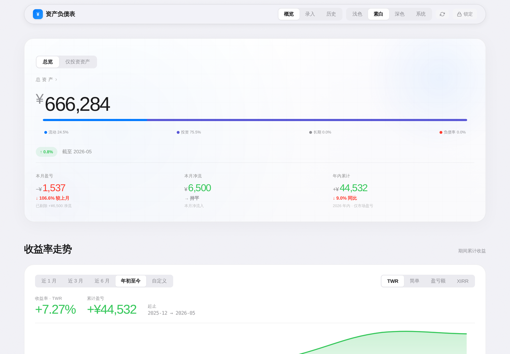
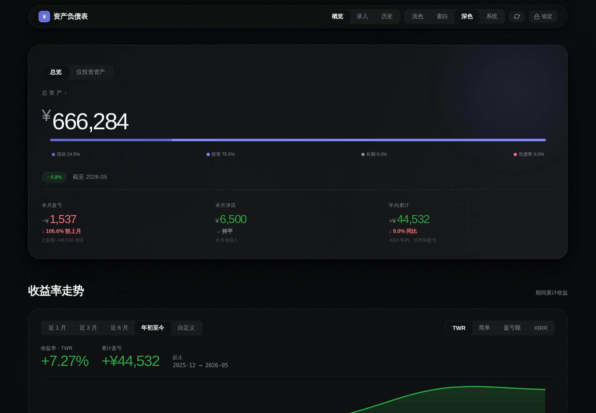

# Asset Ledger（个人资产负债表）

> 端到端加密的个人资产负债表 — 跨券商、跨银行、跨币种的净值全景。
> **数据由你掌控，服务器只能看到密文。**

[](https://developer.mozilla.org/en-US/docs/Web/API/Web_Crypto_API)
[](https://developer.mozilla.org/en-US/docs/Web/API/SubtleCrypto/encrypt)
[](https://workers.cloudflare.com/)
[](./LICENSE)

---

## 界面

| 素白 | 深色 |
|:--:|:--:|
|  |  |

三套主题（素白 / 浅色 / 深色）共用一套布局，CSS 变量驱动，一键切换。

---

## 核心特性

| 安全 | Dashboard | 录入 | 历史 |
|:--|:--|:--|:--|
| 主密码 / Passkey 双解锁 | Hero 巨幅资产 + 月对月变化 | 月度快照批量录入 | 列表 + 对比双视图 |
| PBKDF2 250K → AES-256-GCM | KPI 三连：盈亏 / 净流 / 年内 | 一键复制上月数据 | TWR / 简单 / XIRR 三种收益率 |
| TOFU 写保护 + 严格 CSP | 收益率走势 + 资产分布钻取 | 账户 CRUD + 分组管理 | 异常变化提醒 + CSV 导出 |

---

## 技术栈

| 层 | 技术 |
|:--|:--|
| 前端 | Vanilla JS · 零框架 · 零构建 · 运行时零第三方请求 |
| 加密 | Web Crypto API · AES-256-GCM · PBKDF2 250K · WebAuthn PRF |
| 后端 | Cloudflare Workers + D1（SQLite） |
| 运行时依赖 | Chart.js 4.x + Big.js（本地 vendor，无 CDN） |

---

## 部署

| # | 操作 | 说明 |
|:-:|:--|:--|
| 1 | 创建 D1 数据库 | Cloudflare Dashboard → D1 → 执行 [建表 SQL](#建表-sql) |
| 2 | 设置 GitHub Secrets | `CLOUDFLARE_API_TOKEN` · `CLOUDFLARE_ACCOUNT_ID` · `D1_DATABASE_ID` |
| 3 | `git push main` | GitHub Actions 触发 `wrangler deploy` |

### 本地开发

```bash
git clone https://github.com/<你的用户名>/asset-ledger.git
cd asset-ledger
cp wrangler.example.toml wrangler.toml   # 填入 D1 database_id
npx wrangler dev                          # http://localhost:8787
npm test                                  # 金融计算 + 写保护单元测试
```

### 建表 SQL

```sql
CREATE TABLE IF NOT EXISTS vault (
  id TEXT PRIMARY KEY,
  payload TEXT NOT NULL,
  updated_at INTEGER NOT NULL
);

CREATE TABLE IF NOT EXISTS meta (
  id TEXT PRIMARY KEY,
  salt TEXT NOT NULL,
  verifier TEXT NOT NULL
);
```

---

## 安全模型

- **端到端加密**：主密钥在浏览器内由密码 / Passkey PRF 派生，永不离开客户端；服务器只存 `{ iv, cipher }` 密文
- **写保护（TOFU）**：首次保存时生成 32 字节随机令牌，藏进加密 vault 同步；服务端只存 SHA-256 哈希，之后所有写操作必须出示令牌
- **CSP**：`script-src 'self'`，禁内联脚本 / eval；全部资源本地化，`connect-src 'self'`
- **防覆盖三重保障**：浏览器 localStorage 镜像 → 写入回读校验 → 空库检测强制恢复

---

## 边界

- 单用户设计，不支持多人协作
- 月度手动录入（不对接券商 API）
- Passkey PRF 需 Safari 18+ / Chrome 132+
- 需要 HTTPS 或 localhost（Web Crypto 要求）

---

## License

MIT
